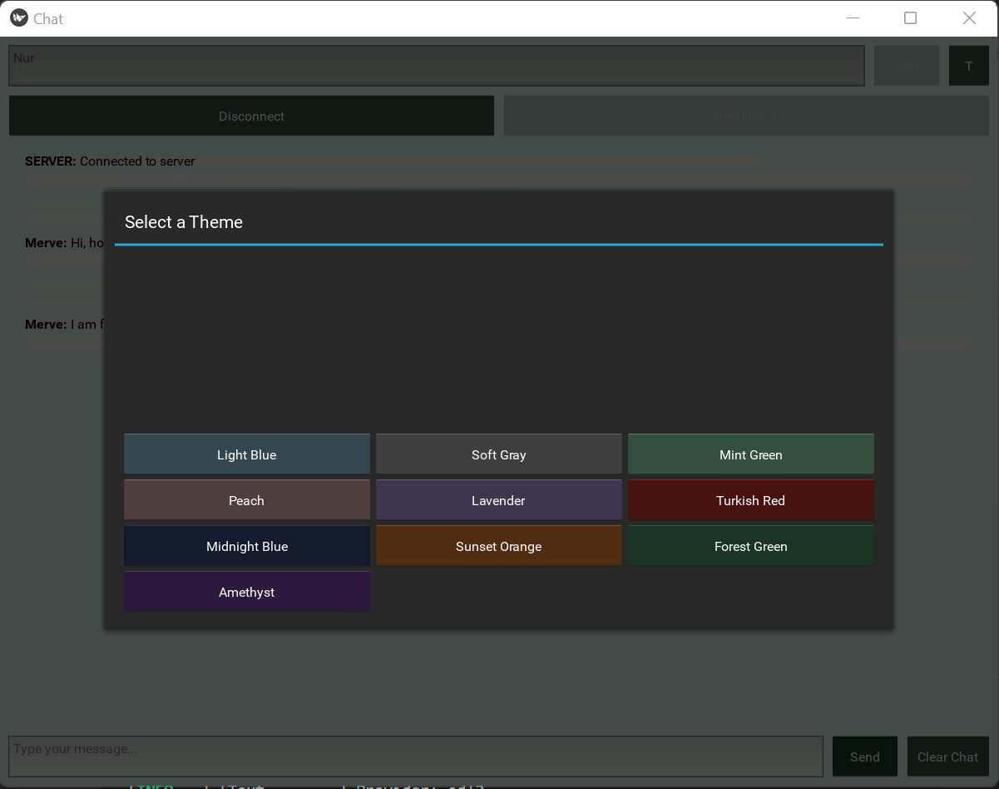

# ChatApp
This is a client-server chat application built using Python, Kivy for the GUI, and socket programming for network communication. The application allows multiple users to connect to a server, send messages, and customize the interface with various themes. Messages are displayed with timestamps and saved to a local chat_log.txt file. Users can join, disconnect, reconnect, and clear the chat log.

# Features
Real-time Messaging: Send and receive messages in real-time using socket communication.
Theming: Choose from multiple themes (e.g., Light Blue, Mint Green, Midnight Blue) to customize the UI.
Chat Log: Messages are saved with timestamps to a local file (chat_log.txt).
User Management: Connect with a username, disconnect, and reconnect to the server.
Responsive UI: Built with Kivy, supporting keyboard input (Enter key to send messages).
Error Handling: Displays connection, disconnection, and message-sending errors.
Prerequisites
Python 3.6+
Kivy (pip install kivy)
python-dotenv (pip install python-dotenv)

# Prerequisites:
Python 3.6 or higher
Kivy (install with: pip install kivy)
python-dotenv (install with: pip install python-dotenv)

# Usage:
Start the server: python server.py The server will bind to the host and port specified in the .env file and accept up to 5 clients.
Run the client: python client.py
Enter a username and click "Join" to connect to the server.
Type messages in the input field and press "Send" or Enter to send.
Use the "T" button to select a theme.
Use "Disconnect" to leave, "Reconnect" to rejoin, and "Clear Chat" to reset the chat log.

# File Structure:
client.py: Main client script with Kivy GUI and socket communication logic
server.py: Server script for handling client connections and message broadcasting
chat.kv: Kivy language file defining the GUI layout
.env: Configuration file for server host and port
chat_log.txt: Auto-generated file for storing chat messages

# Installation:
Clone the repository: git clone cd
Install dependencies: pip install -r requirements.txt
Create a .env file in the project root to configure the server host and port.
Note: The application requires these environment variables to connect to the server. If they are missing, the program will raise an error.
Ensure the chat.kv file is in the same directory as the main script.

# Contributing
Contributions are welcome! Please submit a pull request or open an issue for bugs, features, or improvements.

# License
This project is licensed under the MIT License.
